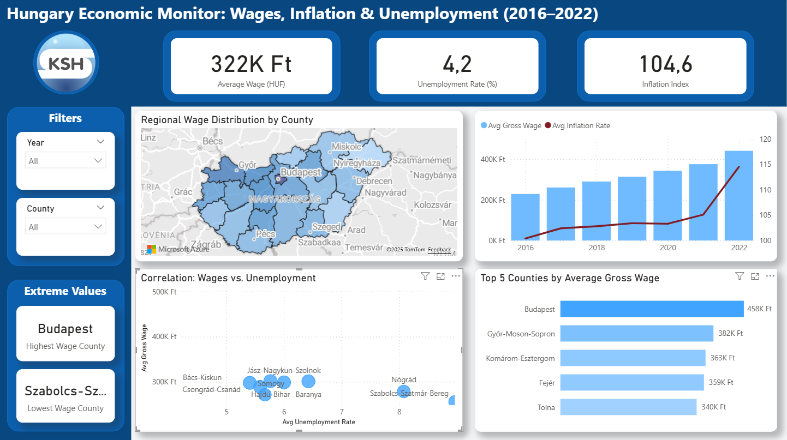
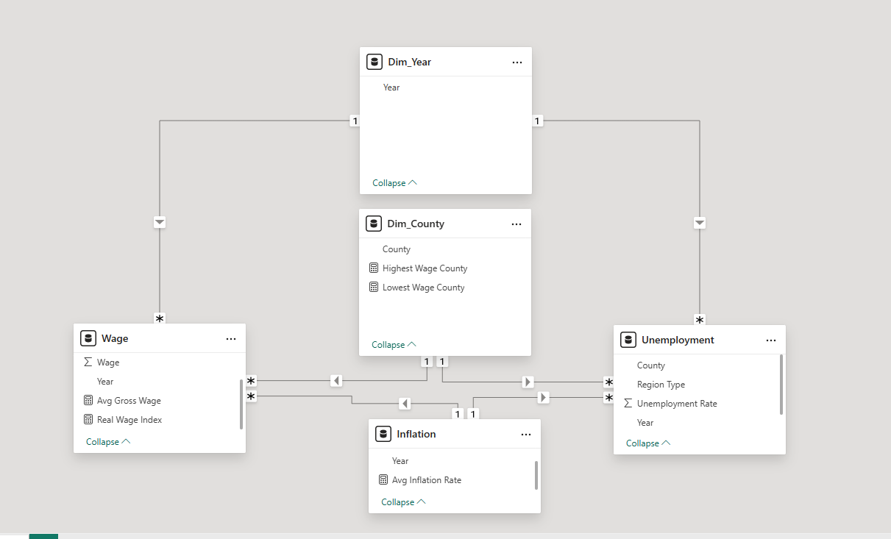

# Hungary Economic Monitor (2016–2022)

### Project Overview
This project is a comprehensive Power BI analysis of the Hungarian labor market and economic trends based on official KSH (Central Statistical Office) data.

**Key Goals:**
* Visualize the correlation between Unemployment and Gross Wages (Phillips curve).
* Analyze Real Wage growth adjusted for Inflation (CPI).
* Identify regional disparities across 19 counties + Budapest.

### Dashboard Preview

*(Note: Static preview. Download the .pbix file to interact.)*

### Tech Stack & Methodology
This is not just a visualization; it includes a full BI workflow:

1.  **ETL (Extract, Transform, Load):**
    * Used **Power Query** to clean messy KSH data.
    * Applied **Unpivot** to transform wide tables into a tabular format.
    * Filtered inconsistent data ranges to ensure accuracy.
2.  **Data Modeling:**
    * Built a **Star Schema** model.
    * Created `Dim_Year` and `Dim_County` dimension tables for efficient filtering.
    * 
3.  **DAX Calculations:**
    * Implemented measures for `Avg Gross Wage`, `Real Wage Index`, and `Unemployment Rate`.
    * Used `CALCULATE` and `DIVIDE` for safe division handling.

### Key Insights
* **Strong Negative Correlation:** Higher unemployment regions (e.g., East Hungary) consistently show lower wages.
* **Real Wage Growth:** Despite inflation spikes, nominal wages have maintained an upward trend in the analyzed period.

---
*Created by csakig*
